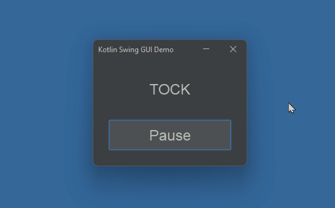

# Kotlin GUI Timer Demo

This is a demo of how to create and use a timer in a Kotlin / Swing application. 

Timers can be used to trigger events on a regular basis, after a certain time has elapsed, etc. 

Timers can be started / stopped in your code, and can be checked to see if they are running or not.

